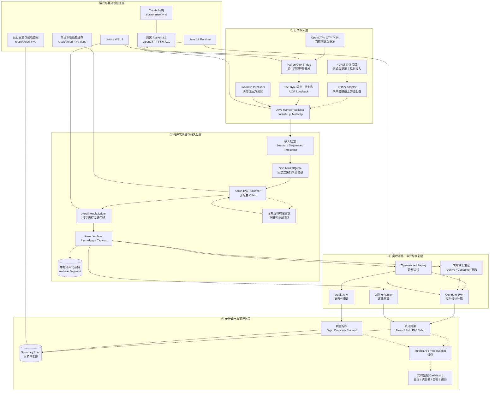

# YDTrader 高并发行情系统架构图

## 图例与边界

- 实线表示当前已经实现并完成验收的链路，虚线表示下一阶段规划。
- OpenCTP/CTP 是 YDApi 休市期间的测试行情入口，不改变正式架构的数据源定位。
- 正式接回 YDApi 时只替换最上游 Adapter；SBE、Aeron、Archive、计算、审计和重放链路保持不变。
- Dashboard 当前属于规划范围，现阶段结果通过 summary 和日志输出。
