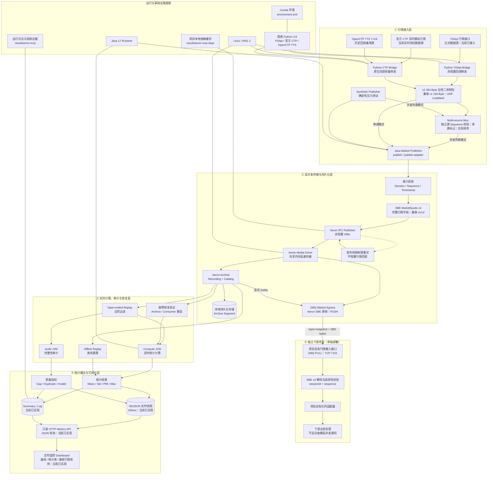

# YDTrader 高并发行情系统架构图

## 图例与边界

- 实线表示当前已经实现并完成验收的链路，虚线表示下一阶段规划。
- YDApi 已通过专用 bridge 接入固定 UDP adapter 协议，并共用 SBE、Aeron、Archive、计算、审计和重放链路。
- 统一入口通过 `--source-config <独立 JSON>...` 接受一到多份配置，分别配置 runtime、连接端点、
  合约、repeat 和超时，再启动对应的独立 bridge。每个源在自己的 loopback UDP 端口上维护并校验
  输入 sequence；Multi-source Mux 写入来源标签并为合并流分配全局 sequence。旧的 `--sources`
  共享参数模式只为命令兼容保留，新部署不使用它。
  合并后仍只有一条 Aeron publication、一份 Archive recording 和一个 ZMQ 出口，避免复制持久化与恢复链路。
- 任一来源缺包、断流或提前退出都会使整次多源运行失败。Compute 输出 `latency_by_source`，
  Dashboard 同时展示本次连接的来源列表和按源统计。
- 统一消息模型预留五档：YDApi 仅填一档，CTP 可填五档，缺失档位保持空值。
- 通用接口开在高并发传输与持久化层的 Aeron 出口：实时模式订阅原始 IPC stream，恢复模式
  读取同一 recording 的 replay。这样下游收到的是已经完成接入校验、可以审计和重放的规范 SBE
  行情，又不会让下游处理速度反向参与 Aeron publisher 的 flow control。
- 跨进程边界使用原生 ZMTP TCP `PUSH/PULL`，不是让 Aeron“改成 ZMQ”。Aeron 继续负责共享内存
  高速传输和 Archive 持久化，ZMQ 只负责把一个独立消费支路送到另一个进程或服务器。
- 两侧只共享版本化 SBE/ZMQ 线协议。高并发项目不导入下游包；下游项目也不导入高并发包，
  各自在自己的仓库实现出口或输入接口，因此可以分别构建、打包、升级和回滚。
- ZMQ HWM 不是无损承诺。适配器在发送超时、SBE 损坏或 sequence 缺口时立即失败并留下 checkpoint，
  运维应从 Archive 显式 replay 恢复，不能静默丢行情后继续运行。
- 官方 CTP 实时模拟行情用于备用快照验收；OpenCTP TTS 仅作 7×24 历史回放备用。
- Dashboard 当前从 Compute/Audit 的下游快照和最终 summary 读取数据，不订阅 Publisher，
  不参与 Aeron flow control；告警推送和 WebSocket 属于后续规划。
- Compute 使用 HdrHistogram 在线维护按中国时区 15 分钟行情窗口和按合约的延迟分布，
  输出 `count / mean / std / p50 / p90 / p95 / p99 / max`，不写逐笔延迟明细。

## 无加密运行边界

- 项目不再包含许可证、机器绑定、运行密码、激活、到期销毁或加密状态；业务入口直接分发到原有模块。
- UDP loopback、SBE、Aeron IPC、Archive、NDJSON 和 Dashboard API 均不增加项目级加密层，消息结构与并发路径保持不变。
- YDApi/CTP 的柜台账号密码仍只从数据源主机配置读取，用于登录数据源或交易柜台，不写入 SBE 消息、Aeron Archive、统计结果或 Dashboard。
- 去掉项目加密不等于去掉交易风控；真实报单的 `--send`、策略身份、暂停标志、报单和撤单阈值继续生效。
